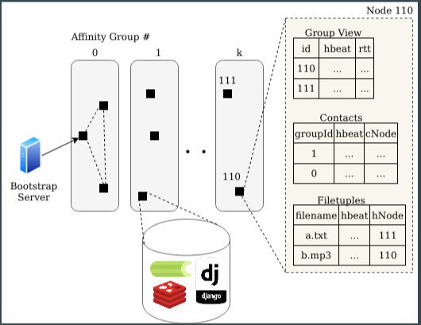

# Efficient and Stable Peer-To-Peer Distributed Hash Table System

This project is based on the following papers: 
* Distributed Hash Table, **Kelips**: https://www.cs.cornell.edu/home/rvr/papers/Kelips.pdf
* **Gossip-style Failure Detection**: https://www.cs.cornell.edu/home/rvr/papers/GossipFD.pdf 


## System Architecture



## System Setup

* Unzip/Clone project source
```
$ unzip project.zip
$ cd quick-store/
OR 
$ git clone https://github.com/Akash-Pateria/quick-store.git
```

* Install python virtual environment package
```
$ apt install python3-venv
```

* Create a virtual environment and activate it
```
$ python3 -m venv env
$ source env/bin/activate
```

* Install package dependencies
```
$ pip3 install -r requirements.txt
```

* Install Redis server and ensure that it runs on default 6379 port
```
$ apt install redis-server
$ redis-cli ping
```

* Apply Django model migrations
```
$ python manage.py makemigrations webapp
$ python manage.py migrate webapp
$ python manage.py migrate
```

* Create one default heartbeat object for node local timestamp
```
$ python manage.py shell
> from webapp.models import Misc
> Misc.objects.create(name="heartbeat")
CTRL+d for exit
```

* Open another terminal tab and run celery for spawning periodic tasks
```
$ cd p2p_File_Sharing
$ source env/bin/activate
$ celery -A FileSharingSystem worker -l info -B
```

* Deploy Bootstrap Server as an application and Start it for acknowledging new node join-request.
```
bootstrapServer/$ python manage.py runserver 0:8000
```          
**Note**: Perform this last step only on a seperate node (no db setup required for this application). System assumes that this node never fails. In production envrionment, it is prudent to have multiple backup servers for such tasks. 


## Project Structure

* **App/**- Contains application related configurations such as celery setup, url    configs, and app settings. 
* **quick-store/**-
  * Gossip.py - contains handler of /heartbeat,  /contact-heartheat, /delete-node endpoints
  * Tasks.py - contains periodic task implementations:     
    * detect_failure
    * disseminate_contact_heartbeat
    * disseminate_heartbeat
    * increment_heartbeat
  * Gossip.yaml - contains gossip configurable parameters
  * Models.py - Django model definitions
  * Urls.py - System routes
  * Views.py - contains endpoint definitions of file operations
  * Node.py: contains node joining protocol operations
  * bootstrapServer/views.py - contains logic for accepting new node join-requests.
* **Requirement.txt**- contains system package dependencies
* **Manage.py**- Django manager


## System usage

System supports two major operations: File Upload (object insertion) and  File Download (object lookup)
**Note**: It is recommended to use an API Client (eg. Postman) to hit the required endpoint.

* File Upload Endpoint:
```
  HTTP Method: POST
  URL: http://<IP address of the node>:<Port>/admin/webapp/upload/
  Body  :
  {
  “file_obj “: <Select the file to be uploaded>
  “file_name” : <filename>
  }
```

* File download Endpoint:
```
  HTTP Method: GET
  URL: http://<IP address of the node>:<Port>/admin/webapp/download?fileName=<filename> 
  Filter parameter to the request is the filename you are looking for. 
  This get API will download the file to /media/downloads folder on the server on which API is targeted.
```

* Node Join Endpoint

```
  HTTP Method: GET
  URL: http://<IP address of the bootstrap server>:<Port>/bootstrapServer/newNodeIP  
  newNodeIP - This is the IP address of the new node that you want to join the system.
```

 

## Data Operations

1. Setup system nodes.
2. Start the bootstrap server to add nodes into the system using Joining Protocol
3. Start inserting data objects through file upload endpoint. 
4. Perform the file lookup operations on the files inserted.

**System Info**: System consists multiple (say k) virtual groups and uses a cryptographic hash function SHA-1 on node identifier to ensure workload balancing across these groups. With high probability, every group holds N/k nodes. In addition, object insertion uses the same method to place the files having each group holds F/k files.


## Failure Detection

1. Run the setup on participating nodes. Start the server on all such nodes.
2. Add these nodes into the system using node join operation
3. Crash stop one running/participating node
4. CTRL+c on node’s **runserver** and **celery** terminal

After 48 seconds (i.e. 2 * T_fail seconds, T_fail is configured in gossip.yaml), all the members (to this failed node) should delete this failed node entry from their membership list. Failure detection messages can also be observed on the terminal. 

**System Info**: Failure detection service uses heartbeat mechanism to detect cash-stop failures. It progresses as follows: 
- Every node updates its own heatbeat in its own local membership list in every second.
- After every Gossip Period, it gossips its updated mem_list to a set of gossip targets to inform other members about its liveliness. These target node selection uses spatial gossip method i.e. nodes that are present closer to the given node are picked for gossip (uses RTT field on mem_list).
- On receipt, the receiver updates its mem_list against the receieved list and keeping updated records from deletion. It gossips the same list to its target nodes and heartbeat disseminate like a fire in a network.
- Every node runs a failure detection periodic task using celery and check for last updated timestamp on every member heartbeat.
